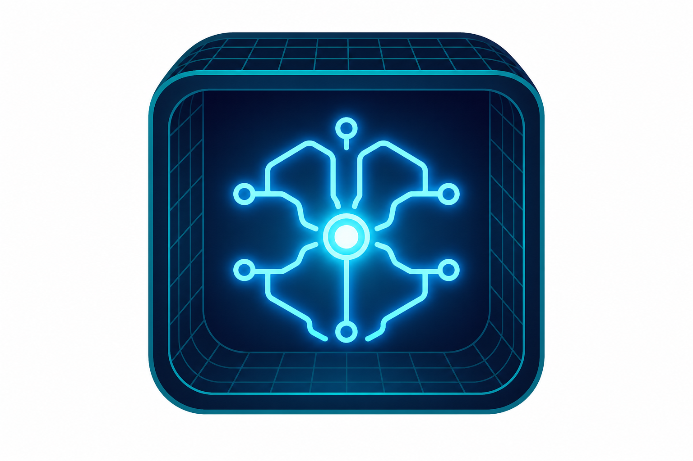

[](LICENSE)

<p align="center">
  
</p>

# AgentLoop

Run Claude Code in a secure [OpenShell](https://github.com/NVIDIA/OpenShell) sandbox with Google Vertex AI and GitHub access. One command, zero config.

```bash
agentloop                          # interactive on current dir
agentloop -p "fix the tests"       # unattended with prompt
agentloop -r owner/repo#42         # checkout and review a PR
```

## What it does

- Creates an isolated OpenShell sandbox container
- Uploads your local repo (with `.git`) or clones a remote one
- Runs Claude Code with full tool access (`dontAsk` permission mode)
- Authenticates to Vertex AI via gcloud ADC (credentials never enter the container)
- Authenticates to GitHub via the OpenShell credential proxy (token never enters the container)
- Enforces deny-by-default network policy (only GitHub + Google + Vertex AI allowed)
- Cleans up on exit (optional)

## Prerequisites

**Required:**
- [OpenShell](https://github.com/NVIDIA/OpenShell) installed with gateway running
- [Docker](https://docs.docker.com/get-docker/) or [Podman](https://podman.io/) 5.x+
- [gcloud CLI](https://cloud.google.com/sdk/docs/install) with ADC configured
- GitHub token (via `gh auth login` or `GITHUB_TOKEN` env var)

**Install OpenShell + gateway:**
```bash
curl -LsSf https://raw.githubusercontent.com/NVIDIA/OpenShell/main/install.sh | sh
brew services restart openshell
```

**Set up Google Vertex AI auth:**
```bash
gcloud auth application-default login
export ANTHROPIC_VERTEX_PROJECT_ID=your-gcp-project
export CLOUD_ML_REGION=global   # optional, defaults to global
```

**Set up GitHub auth:**
```bash
gh auth login   # agentloop auto-reads from gh CLI
```

## Install

```bash
# Option 1: Run directly from GitHub (no install needed)
uvx --from git+https://github.com/agentshed/agentloop agentloop

# Option 2: Install as a global CLI tool
uv tool install git+https://github.com/agentshed/agentloop

# Option 3: Run from a local checkout
git clone https://github.com/agentshed/agentloop
cd agentloop
uv run agentloop
```

## Usage

### Interactive mode (default)

Opens Claude Code in your terminal inside the sandbox:

```bash
# Current directory
agentloop

# Specific directory
agentloop /path/to/project

# Remote repo
agentloop -r owner/repo
```

### Unattended mode

Runs a prompt and exits:

```bash
# Run a task
agentloop -p "fix all failing tests"

# Run and keep sandbox alive after
agentloop -p "refactor the auth module" --keep

# Run with timeout
agentloop -p "add unit tests" -t 300

# Read prompt from file
agentloop -f task.md
```

### Remote repos, branches, and PRs

A single `-r` flag auto-detects the format:

```bash
# Clone default branch
agentloop -r owner/repo

# Clone specific branch
agentloop -r owner/repo@feature-branch
agentloop -r owner/repo@fix/something

# Checkout a PR
agentloop -r owner/repo#42

# Full GitHub URLs work too
agentloop -r https://github.com/owner/repo
agentloop -r https://github.com/owner/repo/tree/main
agentloop -r https://github.com/owner/repo/tree/fix/bulk-action
agentloop -r https://github.com/owner/repo/pull/42

# Without https://
agentloop -r github.com/owner/repo
```

### Save output

Download the sandbox workspace to a local directory after the run:

```bash
# Save workspace on exit
agentloop -p "generate report" -o ./results

# Save even on error or Ctrl-C
agentloop -p "risky refactor" -o ./backup --output-on-error
```

## CLI Reference

### Flags (short form)

| Flag | Long form | Description |
|------|-----------|-------------|
| `-p` | `--prompt` | Prompt for Claude Code (switches to unattended mode) |
| `-f` | `--prompt-file` | Read prompt from file |
| `-m` | `--model` | Model override (e.g., `claude-opus-4-6`) |
| `-r` | `--repo` | Clone remote repo/branch/PR (auto-detects format) |
| `-o` | `--output` | Save sandbox workspace to local dir on exit |
| `-n` | `--name` | Sandbox name (auto-generated if omitted) |
| `-e` | `--engine` | Container engine: `docker` (default) or `podman` |
| `-t` | `--timeout` | Unattended execution timeout in seconds |
| `-v` | `--verbose` | Increase verbosity (`-v`, `-vv`, `-vvv`) |
| `-h` | `--help` | Show help |

### Flags (long form only)

| Flag | Description |
|------|-------------|
| `--provider` | API backend: `vertex` (default) or `anthropic` |
| `--no-github` | Skip GitHub provider setup |
| `--image` | Custom container image or Dockerfile path |
| `--no-git-ignore` | Upload all files including .gitignore'd ones |
| `--keep` | Keep sandbox alive after exit (default: delete) |
| `--gpu` | Enable GPU passthrough |
| `--cpu` | CPU limit (e.g., `2`, `500m`) |
| `--memory` | Memory limit (e.g., `4Gi`, `8G`) |
| `--env` | Inject env var: `KEY=VALUE` (repeatable) |
| `--label` | Add sandbox label: `KEY=VALUE` (repeatable) |
| `--forward` | Forward local port to sandbox (e.g., `8080`) |
| `--editor` | Open remote editor: `vscode` or `cursor` |
| `--allow-pypi` | Allow egress to pypi.org for pip/uv installs |
| `--allow-npm` | Allow egress to registry.npmjs.org |
| `--extra-host` | Allow additional host: `HOST:PORT:ACCESS` (repeatable) |
| `--no-google-auth` | Disable Google OAuth endpoints |
| `--no-vertex` | Disable Vertex AI endpoints |
| `--output-paths` | Sandbox paths to download (repeatable) |
| `--output-on-error` | Save output even on error/kill |
| `--dry-run` | Print openshell commands without executing |

### Subcommands

```bash
agentloop init            # Create default config at ~/.agentloop/agentloop.yaml
agentloop init --local    # Create per-project config in current directory
agentloop init --force    # Overwrite existing config
agentloop config          # Show resolved config (merged: CLI + env + local + global)
```

## Configuration

Config files use YAML with this resolution order (highest wins):

```
CLI flag  >  env var  >  ./agentloop.yaml (local)  >  ~/.agentloop/agentloop.yaml (global)  >  built-in defaults
```

Generate the default config:

```bash
agentloop init
```

Key settings in `~/.agentloop/agentloop.yaml`:

```yaml
# Claude Code CLI args
claude:
  command: claude
  default_args:
    - --permission-mode
    - dontAsk
    - --settings
    - /sandbox/.agentloop-settings.json
    - --allowedTools
    - "Bash(*)"
    - Read
    - Edit
    - Write
    - NotebookEdit
    - WebFetch
    - WebSearch

# Default model
model: claude-opus-4-6

# Container engine
engine:
  backend: docker

# Providers
providers:
  inference: vertex
  github: true
  vertex:
    project: null       # or set ANTHROPIC_VERTEX_PROJECT_ID env var
    region: global      # or set CLOUD_ML_REGION env var

# Network policy (deny-by-default, these are allowed)
network:
  github: true          # github.com, api.github.com
  google_auth: true     # oauth2.googleapis.com
  vertex: true          # regional Vertex AI endpoints
  allow_pypi: false     # pypi.org
  allow_npm: false      # registry.npmjs.org
```

### Per-project config

Create `agentloop.yaml` in your project root to override globals:

```yaml
model: claude-opus-4-6
network:
  allow_pypi: true
sandbox:
  memory: 16Gi
  gpu: true
```

## Security Model

| Layer | Mechanism | Details |
|-------|-----------|---------|
| Credentials | OpenShell credential proxy | Real tokens never enter the container. Proxy resolves placeholders on egress. |
| Network | Deny-by-default policy | Only GitHub, Google Auth, and Vertex AI allowed. All else blocked. |
| Filesystem | Landlock LSM | Workspace read-write, system paths read-only. |
| Process | Seccomp + non-root | Syscall filtering, `PR_SET_NO_NEW_PRIVS`, no core dumps. |
| Inference | `inference.local` routing | Claude API calls routed through gateway proxy to Vertex AI. |

**Note:** GitHub credential injection works through OpenShell's L7 proxy with binary identity binding. The `gh` and `git` binaries are explicitly allowed in the network policy. The real GitHub token is resolved by the proxy on egress — it never appears in the container's environment.

## How It Works

```
Host Machine                    OpenShell Gateway              Sandbox Container
─────────────                   ─────────────────              ─────────────────
gcloud ADC ──────────────────>  Vertex provider                ANTHROPIC_API_KEY=placeholder
                                (OAuth2 refresh)               ANTHROPIC_BASE_URL=inference.local
                                                               
GITHUB_TOKEN ────────────────>  GitHub provider                GITHUB_TOKEN=placeholder
                                (credential proxy)             (proxy resolves on egress)
                                                               
                                Network policy ────────────>   deny-by-default
                                (Landlock, seccomp)            github.com: allowed (gh/git only)
                                                               inference.local: allowed
                                                               everything else: blocked
```

## Development

```bash
git clone https://github.com/agentshed/agentloop
cd agentloop
uv pip install -e .
uv run agentloop --version
```

## License

Apache-2.0
